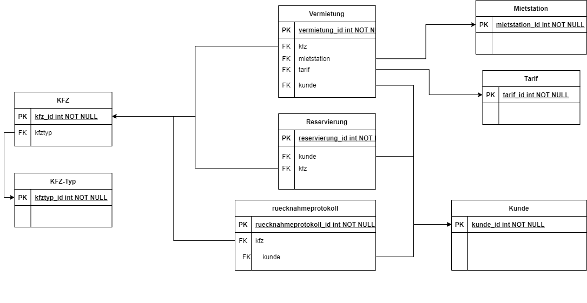

# ProWinfo

Kostenplanung,Aufgabenpalnung,Zeitplan ist im folgenden [Google-Doc](https://docs.google.com/document/d/1JaarAv5viSyzTMZQ1FgT-eZw4dUly8w9LsJdQGs9u2s/edit?usp=sharing) aufgeführt
 Das Gantt-Diagramm findet man auf [Excel Online](https://1drv.ms/x/s!AjjSCOAp57JYsXoE8Uka6UlPMsil?e=Wt3Imt)
  
## einfache Struktur der Datenbank ohne Tabellenspezifische Attribute

